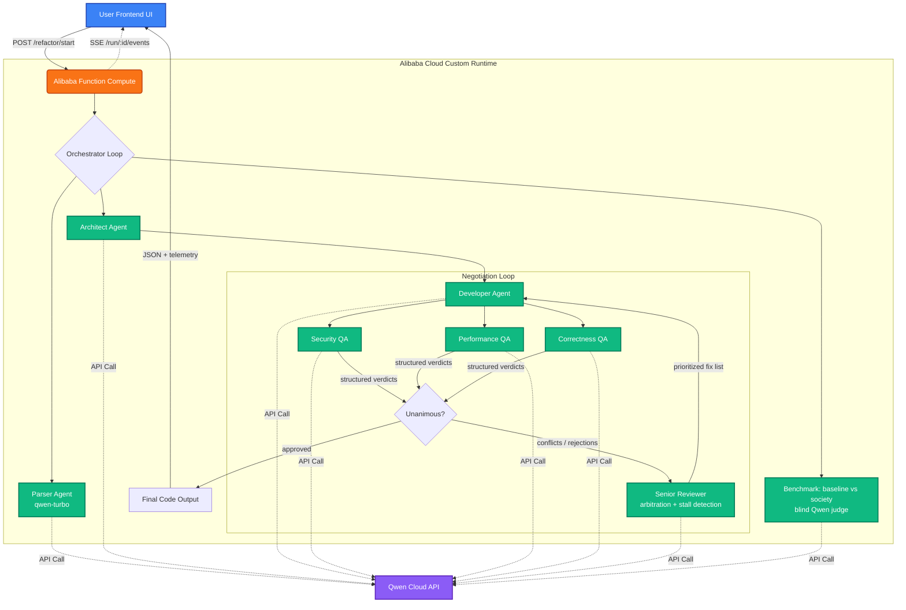

# 🤖 RefactorBot Society


**RefactorBot Society** is an autonomous, serverless multi-agent pipeline hosted on Alibaba Cloud Function Compute. Designed to modernize and secure legacy code, it triggers a "society" of specialized AI personas powered by Qwen Large Language Models to architect, write, and aggressively QA code before returning it — along with the full negotiation timeline, the panel verdicts, and a **built-in benchmark that measures the society's quality gain over a single-agent baseline**.

The project also ships a second agent society: a **NIS2 incident-response pipeline** (see [NIS2 Incident Response](#%EF%B8%8F-nis2-incident-response-module) below).

Originally built by JemBuildz; extended for the Global AI Hackathon with Qwen Cloud (Track 3: Agent Society).

## 🧰 Built With

* **Alibaba Cloud Function Compute** — serverless custom-runtime infrastructure
* **Alibaba Cloud DashScope API** — Qwen Large Language Models engine
* **TypeScript & Node.js** — core backend orchestration
* **Express.js + Server-Sent Events** — endpoint routing, live negotiation streaming, dashboards
* **HTML5 / CSS3 / JavaScript** — glassmorphism timeline dashboards

---

## 💡 Inspiration

Legacy code modernization is usually a painful, manual process. While single-prompt LLMs can translate code from one language to another, they frequently hallucinate, introduce security vulnerabilities (like SSRF or CORS misconfigurations), and fail to grasp enterprise architecture. We wanted to build a system that doesn't just translate code, but *engineers* it — and **proves, with numbers, that the society beats a single agent**.

## ⚙️ How The Society Works

When fed legacy monolithic code via the interactive dashboard, it triggers a rigorous negotiation loop between specialized personas:

1. **The Parser** *(qwen-turbo)*: Dissects the legacy logic and identifies deprecated patterns.
2. **The Architect**: Designs a modern, asynchronous target framework (e.g., FastAPI).
3. **The Developer**: Drafts the initial code based on the Architect's blueprint.
4. **The QA Review Panel — three specialists in parallel**:
   * **Security QA** hunts injection surfaces, unvalidated inputs, SSRF, secrets, CORS issues.
   * **Performance QA** hunts resource leaks, blocking calls in async contexts, missing timeouts.
   * **Correctness QA** verifies the business logic survived the migration intact.

   Each returns a structured verdict `{ approved, severity: none|minor|major|blocker, feedback }`. The three reviews run **concurrently** (one wall-clock round-trip instead of three) and are genuinely independent — they routinely disagree.
5. **The Senior Reviewer (arbiter)**: When the panel conflicts (e.g., Security rejects while Correctness approves), the arbiter reconciles the verdicts into ONE prioritized fix list — security prevails over style, and correctness constraints must never be broken by a fix.

### 🤝 Conflict resolution & convergence detection

Two Track-3-specific mechanisms drive the negotiation:

* **Panel disagreement** is detected explicitly (`N approve / M reject`) and escalated to the arbiter — you can watch it happen live in the timeline.
* **Stall detection**: if the panel raises *identical objections two rounds in a row*, incremental patching has failed; the orchestrator instructs the arbiter to **impose a substantially different implementation strategy** instead of another small diff.

The Developer/QA loop runs for up to 3 negotiation cycles. The final draft is always returned along with the complete agent timeline, the per-reviewer verdicts, token telemetry, and an explicit `approved` flag.

---

## 🏁 Measured Efficiency vs Single-Agent Baseline (Track 3 requirement)

`POST /benchmark` (or the **🏁 Benchmark** button in the dashboard) runs a controlled comparison on identical input:

| | Single-agent baseline | Agent society |
|---|---|---|
| Pipeline | ONE single-shot prompt: parse + design + write + self-check | Parser → Architect → Developer → parallel QA panel → arbitration loop |
| Judged by | Independent Qwen judge, **blind** (never told which candidate is which) | Same judge, same rubric |
| Rubric | security / correctness / architecture / maintainability, 0–10 each | idem |

The report contains both scores, both code outputs, token spend, wall-clock time, and the deltas (`qualityGain`, `qualityGainPercent`, `extraTokens`, `extraSeconds`) — i.e. *what the extra tokens actually buy you*.

> Run it with your own DashScope key to produce the numbers for your submission:
> ```bash
> curl -X POST http://localhost:9000/benchmark \
>   -H "Content-Type: application/json" \
>   -d '{"legacyCode": "def get_user(id, db): ...", "targetFramework": "FastAPI"}'
> ```
> (In `MOCK_QWEN=1` mode the benchmark demonstrates the *mechanism* with illustrative canned scores.)

---

## 🗺️ Architecture Flow



### 💰 Per-agent model routing & token telemetry

Each agent is routed to the cheapest model that can do its job (`parser → qwen-turbo`, everything else `qwen-plus` by default; override per agent with `QWEN_MODEL_PARSER`, `QWEN_MODEL_ARCHITECT`, `QWEN_MODEL_JUDGE`, or globally with `QWEN_MODEL`). Every response's token usage is aggregated **per agent** and returned in the API response and dashboards — so the cost of each negotiation round is visible, not vibes.

---

## 🛡️ NIS2 Incident Response Module

A second five-agent society handles security-incident response with EU NIS2 (Directive 2022/2555, Article 23) reporting:

1. **The Watcher** — triage & severity classification, NIS2 significance assessment
2. **The Tracker** — strictly read-only forensic investigation (timeline, assets, IoCs)
3. **The Diagnostician** — root-cause analysis with confidence level
4. **The Engineer** — containment actions, remediation plan, residual risk
5. **The Scribe** — formal NIS2 incident report (24h early warning / 72h notification / 1-month final report obligations)

Endpoints: dashboard at `GET /nis2`, sync API at `POST /incident`, live-streamed run at `POST /incident/start`.

---

## 📡 API Reference

| Endpoint | Description |
|---|---|
| `POST /refactor` (alias `/invoke`) | Synchronous refactor: `{ legacyCode, targetFramework }` → code + timeline + verdicts + telemetry. |
| `POST /refactor/start` | Starts a background run; returns `{ runId, streamUrl }`. |
| `GET /run/:id/events` | **SSE**: live agent timeline (log replay + streaming), then `done` with the full result. |
| `POST /benchmark` / `POST /benchmark/start` | Society vs single-agent baseline, blind-judged (see above). |
| `POST /incident` / `POST /incident/start` | NIS2 incident-response society. |
| `GET /health` | Version + live/mock mode. |

---

## 🚀 Setup & Local Deployment

### Prerequisites

* Node.js (v18+)
* An Alibaba Cloud account & DashScope API key

### Installation

Clone the repository:

```bash
git clone https://github.com/aleobois-arch/RefractorBot.git
cd RefractorBot
```

Install dependencies:

```bash
npm install
```

Create a `.env` file in the root directory:

```env
QWEN_API_KEY=your_dashscope_api_key_here
PORT=9000
```

Build and start:

```bash
npm run build
npm start
```

Then open `http://127.0.0.1:9000` (RefactorBot) or `http://127.0.0.1:9000/nis2` (incident response).

### 🧪 Offline development (mock mode)

To exercise both pipelines AND the benchmark without a DashScope key or network access (and without spending API credits), start the server with:

```bash
MOCK_QWEN=1 npm start
```

Agents return realistic canned responses instead of calling Qwen. The mock QA panel is **stateful**: Security QA rejects the first draft (major finding) while the other reviewers approve — so the disagreement, arbitration, and re-approval cycle is fully visible offline.

---

## ☁️ Alibaba Cloud Deployment Guide

This project is configured specifically for Alibaba Cloud Function Compute (Custom Runtime).

1. Run `npm run build` to generate the updated `dist` folder.
2. Select the following 3 items in your file explorer: `dist/`, `node_modules/`, `package.json`.
3. Compress these 3 items directly into a `.zip` file (do not zip the parent folder — zip the items themselves).
4. Upload the zip to your Function Compute instance.
5. Set the Function Start Command to: `node dist/server.js`.
6. Set `QWEN_API_KEY` as an **environment variable** in the Function Compute configuration (Configurations → Environment Variables). Do not ship your `.env` file inside the deployment zip — secrets don't belong in build artifacts.

> Note: the Function Compute code directory is read-only at runtime. The orchestrator detects this and writes its optional output files under `/tmp` instead.

### Proof of Alibaba Cloud usage

* [`src/qwen.ts`](src/qwen.ts) — Qwen via the **DashScope** native API (`dashscope-intl.aliyuncs.com`), with retry/backoff and token accounting.
* [`src/orchestrator.ts`](src/orchestrator.ts) — Function Compute runtime detection (`FC_FUNC_CODE_PATH`) and `/tmp` write fallback.

## ⚙️ Advanced Configuration: Tuning the Agent Society

By default, the society allows a maximum of **3 negotiation cycles** between the Developer and the QA panel. If the panel is not unanimous by the third attempt, the loop terminates to prevent runaway API costs, and the response is flagged `approved: false`.

### 1. Adjusting the cycle limit

Open `src/orchestrator.ts` and locate the `MAX_ATTEMPTS` constant in `runRefactorBot`:

```typescript
// src/orchestrator.ts
let approved = false;
let attempts = 0;
const MAX_ATTEMPTS = 3; // Increase this number to allow more negotiation cycles

while (!approved && attempts < MAX_ATTEMPTS) {
    // ... agent loop ...
}
```

### 2. Synchronizing cloud timeouts

If you increase `MAX_ATTEMPTS`, you must also increase your Function Compute execution timeout, or an extended AI debate will hit the serverless timeout. Note that the QA panel runs its three reviews in parallel, so a cycle costs roughly one review round-trip, not three.

**Rule of thumb: ~90–100 seconds per cycle.**

| Cycles | Recommended Function Compute timeout |
|--------|--------------------------------------|
| 3 (default) | 300 seconds (5 minutes) |
| 5 | 600 seconds (10 minutes) |

To update: Function Compute console → your function → **Configurations** → **Basic Settings** → **Execution Timeout Period** → save and deploy.

---

## 🎬 3-minute demo script (video)

1. **(0:00–0:20)** The problem: single-prompt refactors ship vulnerabilities. Show the dashboard.
2. **(0:20–1:20)** Load the sample legacy code (SQL built by string concatenation) → **Initiate Agent Protocol** → watch the live timeline: Parser → Architect → Developer, then the three QA verdicts land — *Security rejects (major: SQL injection), Performance flags minor, Correctness approves* → disagreement banner → Senior Reviewer arbitration → Developer rewrite → unanimous ✅.
3. **(1:20–2:30)** Click **🏁 Benchmark vs Single Agent** on the same input → side-by-side table: judge scores per dimension, token cost, wall clock — "*this is what the extra tokens buy*".
4. **(2:30–3:00)** Quick cut to `/nis2`: paste a ransomware incident, show the 5-step pipeline and the Article 23 report. Close on the telemetry lines.

## 📜 License

MIT — see [LICENSE](LICENSE).
