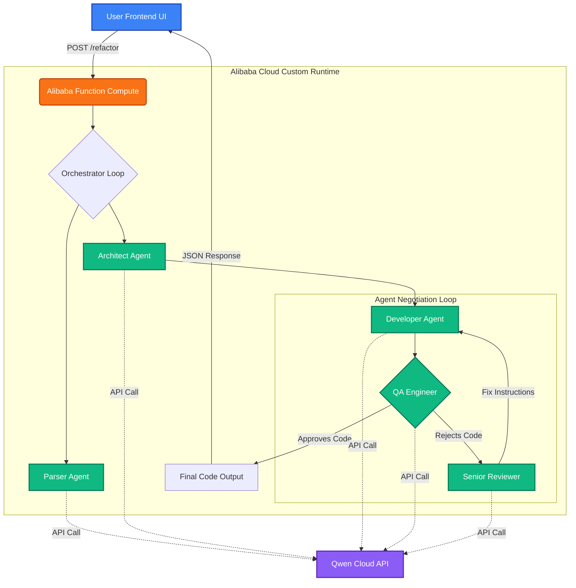

# 🤖 RefactorBot Society


**RefactorBot Society** is an autonomous, serverless multi-agent pipeline hosted on Alibaba Cloud Function Compute. Designed to modernize and secure legacy code, it triggers a "society" of specialized AI personas powered by Qwen Large Language Models to architect, write, and aggressively QA code before returning it — along with the full negotiation timeline and the QA verdict.

The project also ships a second agent society: a **NIS2 incident-response pipeline** (see [NIS2 Incident Response](#%EF%B8%8F-nis2-incident-response-module) below).

Built by JemBuildz.

## 🧰 Built With

* **Alibaba Cloud Function Compute** — serverless custom-runtime infrastructure
* **Alibaba Cloud DashScope API** — Qwen Large Language Models engine
* **TypeScript & Node.js** — core backend orchestration
* **Express.js** — endpoint routing and dashboard serving
* **HTML5 / CSS3 / JavaScript** — glassmorphism timeline dashboards

---

## 💡 Inspiration

Legacy code modernization is usually a painful, manual process. While single-prompt LLMs can translate code from one language to another, they frequently hallucinate, introduce security vulnerabilities (like SSRF or CORS misconfigurations), and fail to grasp enterprise architecture. We wanted to build a system that doesn't just translate code, but *engineers* it.

## ⚙️ How The Society Works

When fed legacy monolithic code via the interactive dashboard, it triggers a rigorous negotiation loop between five distinct personas:

1. **The Parser:** Dissects the legacy logic and identifies deprecated patterns.
2. **The Architect:** Designs a modern, asynchronous target framework (e.g., FastAPI).
3. **The Developer:** Drafts the initial code based on the Architect's blueprint.
4. **The QA Engineer:** A ruthless security and performance reviewer. It actively hunts for resource leaks, unhandled exceptions, and architectural flaws, rejecting the code until it meets enterprise standards.
5. **The Senior Reviewer:** Mediates any QA rejections and provides actionable fix instructions back to the Developer.

The Developer/QA loop runs for up to 3 negotiation cycles. The final draft is always returned along with the complete agent timeline and an explicit `approved` flag in the API response, so the caller knows whether the code passed the QA Engineer's review or hit the cycle limit.

---

## 🗺️ Architecture Flow



---

## 🛡️ NIS2 Incident Response Module

A second five-agent society handles security-incident response with EU NIS2 (Directive 2022/2555, Article 23) reporting:

1. **The Watcher** — triage & severity classification, NIS2 significance assessment
2. **The Tracker** — strictly read-only forensic investigation (timeline, assets, IoCs)
3. **The Diagnostician** — root-cause analysis with confidence level
4. **The Engineer** — containment actions, remediation plan, residual risk
5. **The Scribe** — formal NIS2 incident report (24h early warning / 72h notification / 1-month final report obligations)

Endpoints: dashboard at `GET /nis2`, API at `POST /incident` with body `{ "incident": "<description>" }`.

---

## 🚀 Setup & Local Deployment

### Prerequisites

* Node.js (v18+)
* An Alibaba Cloud account & DashScope API key

### Installation

Clone the repository:

```bash
git clone https://github.com/aleobois-arch/RefractorBot.git
cd RefractorBot
```

Install dependencies:

```bash
npm install
```

Create a `.env` file in the root directory:

```env
QWEN_API_KEY=your_dashscope_api_key_here
PORT=9000
```

Build and start:

```bash
npm run build
npm start
```

Then open `http://127.0.0.1:9000` (RefactorBot) or `http://127.0.0.1:9000/nis2` (incident response).

### 🧪 Offline development (mock mode)

To exercise both pipelines without a DashScope key or network access (and without spending API credits), start the server with:

```bash
MOCK_QWEN=1 npm start
```

Agents then return realistic canned responses instead of calling Qwen.

---

## ☁️ Alibaba Cloud Deployment Guide

This project is configured specifically for Alibaba Cloud Function Compute (Custom Runtime).

1. Run `npm run build` to generate the updated `dist` folder.
2. Select the following 3 items in your file explorer: `dist/`, `node_modules/`, `package.json`.
3. Compress these 3 items directly into a `.zip` file (do not zip the parent folder — zip the items themselves).
4. Upload the zip to your Function Compute instance.
5. Set the Function Start Command to: `node dist/server.js`.
6. Set `QWEN_API_KEY` as an **environment variable** in the Function Compute configuration (Configurations → Environment Variables). Do not ship your `.env` file inside the deployment zip — secrets don't belong in build artifacts.

> Note: the Function Compute code directory is read-only at runtime. The orchestrator detects this and writes its optional output files under `/tmp` instead.

## ⚙️ Advanced Configuration: Tuning the Agent Society

By default, the society allows a maximum of **3 negotiation cycles** between the Developer and the QA Engineer. If the QA Engineer is not satisfied by the third attempt, the loop terminates to prevent runaway API costs, and the response is flagged `approved: false`.

### 1. Adjusting the cycle limit

Open `src/orchestrator.ts` and locate the `MAX_ATTEMPTS` constant in `runRefactorBot`:

```typescript
// src/orchestrator.ts
let approved = false;
let attempts = 0;
const MAX_ATTEMPTS = 3; // Increase this number to allow more negotiation cycles

while (!approved && attempts < MAX_ATTEMPTS) {
    // ... agent loop ...
}
```

### 2. Synchronizing cloud timeouts

If you increase `MAX_ATTEMPTS`, you must also increase your Function Compute execution timeout, or an extended AI debate will hit the serverless timeout.

**Rule of thumb: ~90–100 seconds per cycle.**

| Cycles | Recommended Function Compute timeout |
|--------|--------------------------------------|
| 3 (default) | 300 seconds (5 minutes) |
| 5 | 600 seconds (10 minutes) |

To update: Function Compute console → your function → **Configurations** → **Basic Settings** → **Execution Timeout Period** → save and deploy.

